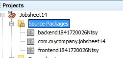
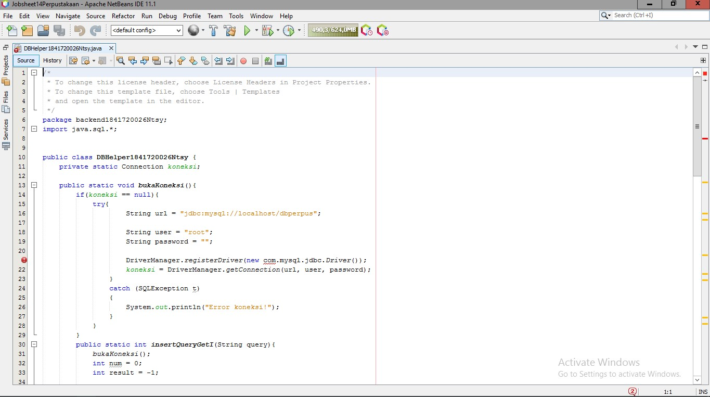
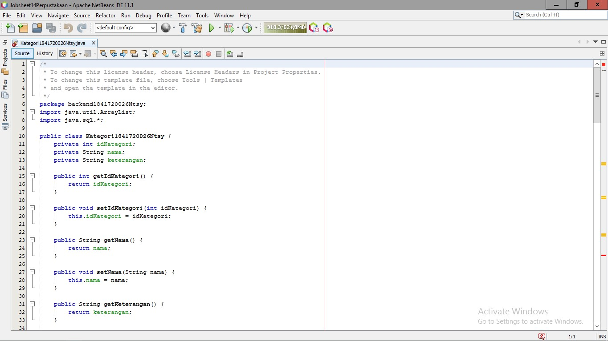
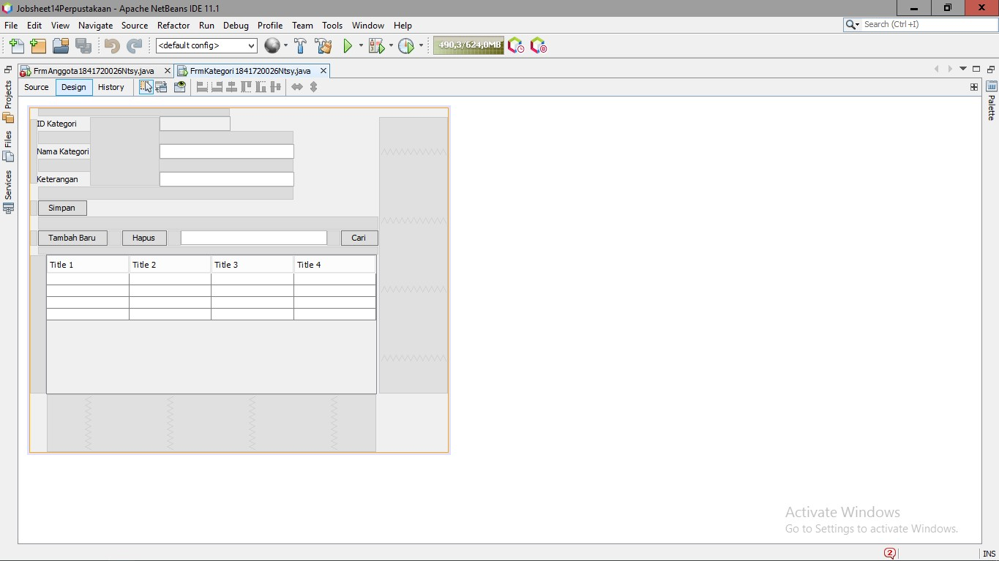
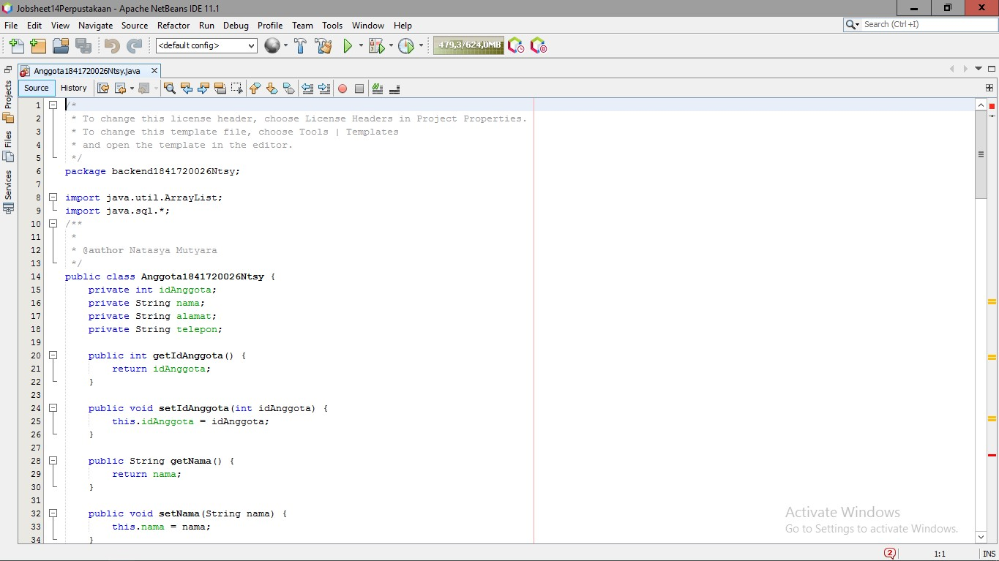
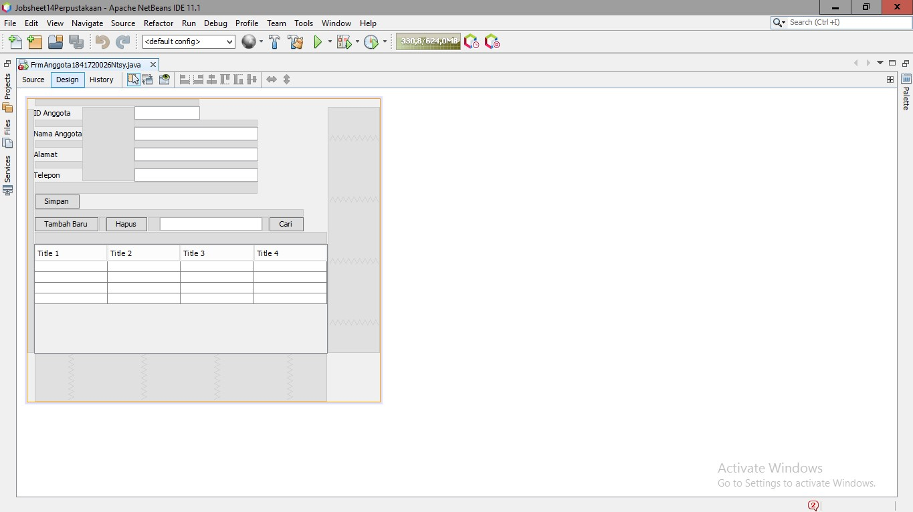
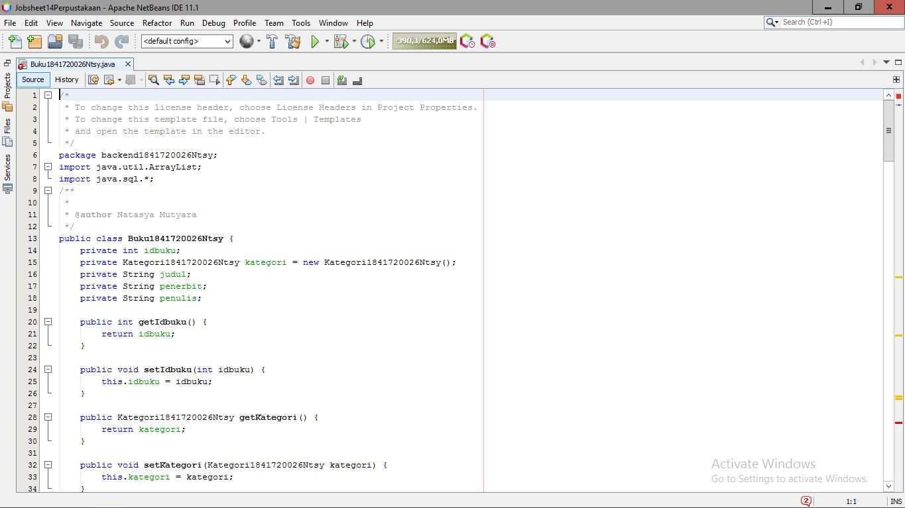
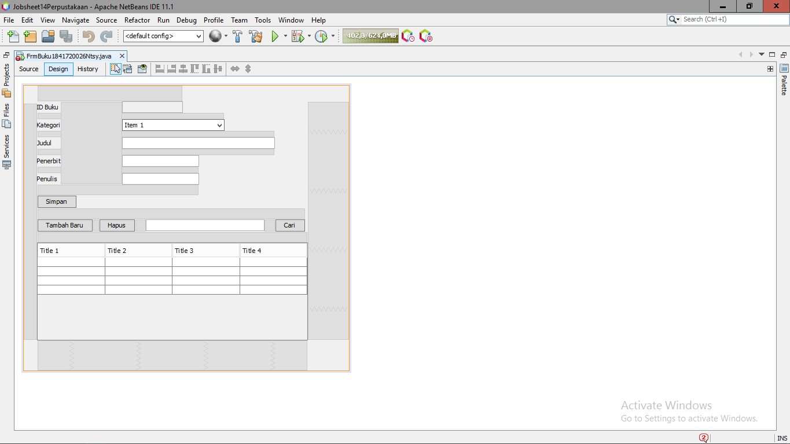
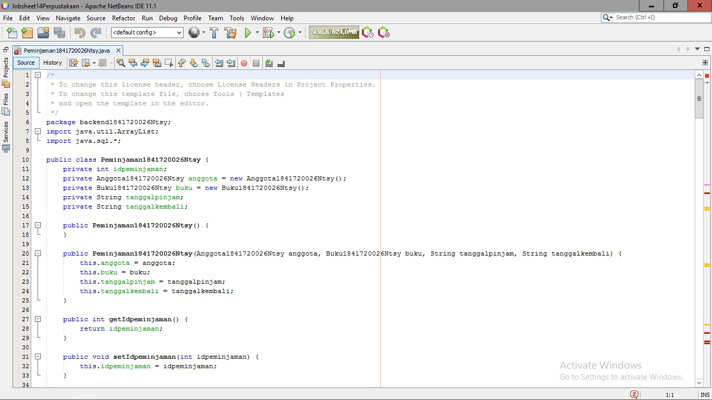
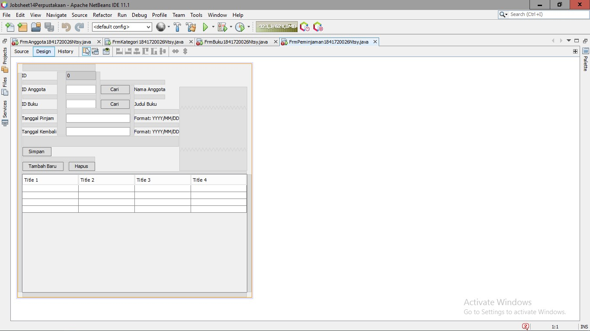

# Laporan Praktikum #14 - GUI dan Database

## Kompetensi

Setelah menempuh materi percobaan ini, mahasiswa mampu mengenal:
1. Menggunakan paradigma berorientasi objek untuk interaksi dengan database
2. Membuat backend dan frontend
3. Membuat form sebagai frontend

## Ringkasan Materi

Dalam Jobsheet ini membahas mengenai aplikasi berbasis database dan dilengkapi dengan form sebagai Graphical User Interface (GUI).

Secara umum, tahapan yang akan kita lakukan adalah sebagai berikut:
1. Membuat database dan tabel-tabelnya.
2. Membuat backend yang berisi class-class yang mewakili data yang ada pada database, dan
class helper untuk melakukan eksekusi query database.
3. Membuat frontend yang merupakan antarmuka kepada pengguna. Frontend ini bisa
berbasis teks (console), GUI, web, mobile, dan sebagainya.

Library yang digunakan untuk project ini antara lain:
1. JDBC, untuk melakukan interaksi ke database.
2. ArrayList, untuk menampung data hasil query ke database.
3. Swing, untuk membuat tampilan GUI.

## Percobaan

### Percobaan 1

Membuat database.
1. Langkah pertama untuk percobaan ini adalah membuat database. Install XAMPP, buka
phpMyAdmin, buat database dbperpus, dan tabel-tabelnya:
Set semua primary key id pada tiap tabel (idanggota, idkategori, idpeminjaman, idbuku) dengan
Auto Increment.

### Percobaan 2
Mempersiapkan project.
1. Buat project baru, beri nama Perpustakaan.
2. Pada project explorer, klik kanan pada Libraries → Add Library, pilih MySQL JDBC Driver.
3. Buat package frontend dan backend. Cara membuat package adalah, pada project explorer, klik
kanan pada Source Packages → New → Java Package, beri nama package nya (frontend,
backend).

### Percobaan 3
Membuat class helper untuk mengeksekusi query SQL.
1. Pada package backend, buat class DBHelper.
2. Import java.sql.*
3. Didalam class ini ada method-method antara lain:
a. bukaKoneksi(), untuk membuka koneksi ke database
b. insertQueryGetId(String query), untuk melakukan insert ke tabel dan mengembalikan
nilai ID yang digenerate oleh database (hasil Auto Increment).
c. executeQuery(String query), untuk mengeksekusi query yang tidak mengembalikan nilai
(misal: insert, update, delete).
d. selectQuery(String query), untuk mengeksekusi select query yang mengembalikan nilai
hasil query.
4. Berikut adalah kode dari class DBHelper. Anda perlu sesuaikan method bukaKoneksi() dengan
setting database yang terinstall di sistem anda. Namun jika anda install XAMPP secara default,
maka setting ini tidak perlu diubah, mungkin nama database saja yang perlu disesuaikan.
Silahkan COPAS kode berikut ini.

Contoh link kode program : [ini contoh link ke kode program](../../src/14_GUI_dan_Database/DBHelper1841720026ntsy.java)

### Percobaan 4

Membuat class Kategori untuk menghandle CRUD pada tabel kategori.
1. Pada package backend, buat class baru yaitu Kategori.
2. Tambahkan import java.util.ArrayList dan java.sql.*
3. Tambahkan atribut sesuai field pada tabel kategori.
4. Tambahkan getter setter untuk setiap atribut. Anda bisa gunakan fasilitas Insert Code pada
NetBeans. Caranya adalah, klik kanan sembarang tempat di editor, pilih Insert Code, pilih Setter
and Getter, centang semua atribut yang ada (idkategori, nama, keterangan).
5. Tambahkan konstruktor default dan konstruktor custom, yang digunakan untuk mengeset
atribut nama dan keterangan. Atribut idkategori tidak boleh diset, karena id ini akan digenerate
secara otomatis lewat fitur AutoIncrement pada MySQL.
6. Tambahkan method getById() untuk mendapatkan objek Kategori yang ada di database
berdasarkan id-nya.
7. Tambahkan method getAll() untuk mendapatkan semua data Kategori yang ada di database, dan
ditampung ke ArrayList<Kategori>.
8. Tambahkan method search() agar bisa melakukan pencarian data. Method ini mirip dengan
method getAll() namun querynya berbeda.
9. Tambahkan method save(). Method ini memiliki dua fungsi, yaitu insert dan update. Jika data
yang diinputkan belum ada (idkategori = 0) maka akan otomatis insert. Jika data yang diinputkan
sudah ada, maka otomatis update.
10. Tambahkan method delete() untuk melakukan operasi penghapusan pada tabel kategori pada
database.

Contoh link kode program : [ini contoh link ke kode program](../../src/14_GUI_dan_Database/Kategori1841720026ntsy.java)

### Percobaan 5
Mencoba backed yang sudah dibuat dengan mengoperasikannya lewat frontend berbasis teks
(console). Percobaan ini dapat anda skip jika anda telah yakin bahwa backend yang anda buat sudah
berfungsi dengan baik.
1. Pada package frontend, buat class TestBackend. Tambahkan import backend.*
2. Berikut kode lengkap untuk class TestBackend. Silahkan di COPAS.
3. Jalankan TestBackend dengan klik kanan, Run File. Cocokkan outputnya:

Contoh link kode program : [ini contoh link ke kode program](../../src/14_GUI_dan_Database/TestBackend1841720026ntsy.java)

### Percobaan 6
Pada percobaan ini kita akan membuat interface GUI untuk class Kategori.
1. Pada package frontend, buat JFrame dengan nama FrmKategori. Caranya adalah, klik kanan
pada package frontend → New →JFrame Form.
2. Susun form sehingga seperti berikut ini, atur propertinya sesuai nomor:

3. Edit kodenya, tambahkan import backend.*, java.util.ArrayList,
javax.swing.table.DefaultTableModel;
4. Tambahkan method kosongkanForm() untuk mengosongkan isian textbox pada form.
5. Tambahkan method tampilkanData() untuk mengambil semua data kategori dari database dan
menampilkannya ke JTable tblKategori.
6. Tambahkan method cari() untuk melakukan pencarian berdasarkan keyword tertentu
7. Pada konstruktor, tambahkan pemanggilan method kosongkanForm() dan tampilkanData(), agar
ketika form ditampilkan pertama kali, maka form isian akan kosong dan data kategori langsung
ditampilkan.
8. Double klik pada btnSimpan untuk menambahkan kode untuk menyimpan data. Aksi
menyimpan ini secara otomatis menentukan apakah insert atau update, karena pada method
save() dari objek kat, sudah dicek apakah data baru atau sudah ada (baca Percobaan 4, no. 9)
9. Double klik pada btnHapus untuk menambahkan kode untuk menghapus data.
10. Double klik pada btnTambahBaru untuk mengosongkan form sehingga dapat digunakan untuk
menginputkan data baru.
11. Double klik pada btnCari untuk melakukan pencarian terhadap keyword yang dimasukkan pada
txtCari.
12. Agar kita dapat memilih data yang ada pada tblKategori, agar dapat diedit atau dihapus, maka
kita tambahkan event mouse click pada tblKategori. Ketika pengguna mengklik pada tblKategori,
maka data tersebut akan ditampilkan di tex field. Caranya, klik kanan pada tblKategori, pilih
Events → Mouse → MouseClicked. Tambahkan kode berikut ini:

Contoh link kode program : [ini contoh link ke kode program](../../src/14_GUI_dan_Database/FormKategori1841720026ntsy.java)

### Percobaan 6
Lakukan hal yang sama untuk data Anggota!
1. Buat class Anggota pada package backend, lengkapi atribut dan method-nya.
2. Lakukan test pada class TestBackend pada package frontend.

Contoh link kode program : [ini contoh link ke kode program](../../src/14_GUI_dan_Database/Anggota1841720026ntsy.java)

### Percobaan 7
Buat form untuk data Anggota.
1. Buat FrmAnggota pada package frontend dan lengkapi komponen, method serta event-nya.

Contoh link kode program : [ini contoh link ke kode program](../../src/14_GUI_dan_Database/FormAnggota1841720026ntsy.java)

### Percobaan 7
Untuk data Buku, caranya kurang lebih sama seperti data Kategori dan Anggota. Hanya saja yang
berbeda adalah:
a. Pemanggilan getKategori().getIdKategori() pada query insert dan update untuk mengeset
idkategori pada tabel buku

b. Query select yang melibatkan join table pada method getById(), getAll() dan search().

Kode lengkap class Buku dapat anda lihat di Lampiran 1. Untuk test buku pada frontend, bisa anda
lihat di Lampiran 2.

Contoh link kode program : [ini contoh link ke kode program](../../src/14_GUI_dan_Database/Buku1841720026ntsy.java)

### Percobaan 8
Membuat GUI untuk data Buku, yang dilengkapi dengan combo box untuk memilih kategori yang
terhubung dengan tabel kategori.
1. Pada package frontend, buat jFrame FrmBuku. Susun formnya sebagai berikut:
2. Edit kodenya, tambahkan import backend.*, java.util.ArrayList,
javax.swing.table.DefaultTableModel, javax.swing.DefaultComboBoxModel;
3. Tambahkan method kosongkanForm() untuk mengosongkan isian textbox pada form.
4. Tambahkan method tampilkanData() untuk mengambil semua data buku dari database dan
menampilkannya ke JTable tblBuku.
5. Tambahkan method cari() untuk melakukan pencarian berdasarkan keyword tertentu.
6. Tambahkan method tampilkanCmbKategori() untuk mengambil data Kategori dari database dan
menampilkannya ke cmbKategori.
Agar cmbKategori menampilkan nama kategori, maka override method toString() pada class
Kategori. Tambahkan kode berikut ini pada class Kategori:
7. Pada konstruktor, tambahkan pemanggilan method kosongkanForm(), tampilkanCmbKategori()
dan tampilkanData(), agar ketika form ditampilkan pertama kali, maka form isian akan kosong
dan data buku langsung ditampilkan.
8. Double klik pada btnSimpan untuk menambahkan kode untuk menyimpan data. Aksi
menyimpan ini secara otomatis menentukan apakah insert atau update, karena pada method
save() dari objek kat, sudah dicek apakah data baru atau sudah ada (baca Percobaan 4, no. 9)
9. Double klik pada btnHapus untuk menambahkan kode untuk menghapus data.
10. Double klik pada btnTambahBaru untuk mengosongkan form sehingga dapat digunakan untuk
menginputkan data baru.
11. Double klik pada btnCari untuk melakukan pencarian terhadap keyword yang dimasukkan pada
txtCari.
12. Agar kita dapat memilih data yang ada pada tblBuku, agar dapat ditampilkan di textfield untuk
diedit atau dihapus, maka kita tambahkan event mouse click pada tblKategori. Caranya, klik
kanan pada tblBuku, pilih Events → Mouse → MouseClicked. Tambahkan kode berikut ini:
13. Jalankan form dengan opsi Run File. Kemudian ujicoba tambah baru, edit, hapus, cari.

Contoh link kode program : [ini contoh link ke kode program](../../src/14_GUI_dan_Database/FormBuku1841720026ntsy.java)

## Tugas
1. Buatlah class Peminjaman.
2. Buatlah form FrmPeminjaman dan susun sebagai berikut:
3. Atur kode program agar dapat menangani transaksi peminjaman dan pengembalian.
Note:
Pada textbox ID Anggota, pengguna tinggal memasukkan ID anggota, kemudian menekan
tombol Cari. Jika ketemu, maka label “Nama Anggota” yang ada di samping tombol Cari tersebut
akan menampilkan nama anggota dari ID yang dimasukkan tadi. Begitu juga dengan ID Buku.

Contoh link kode program : [ini contoh link ke kode program](../../src/14_GUI_dan_Database/Peminjaman1841720026ntsy.java)

Contoh link kode program : [ini contoh link ke kode program](../../src/14_GUI_dan_Database/FormPeminjaman1841720026ntsy.java)

## Kesimpulan
Dari Praktikum ini kita dapat membuat sistem informasi Perpustakaan, yang memiliki data yaitu Buku,Kategori, Anggota dan Peminjaman. dan Fitur yang ada pada aplikasi ini adalah anggota dapat
melakukan peminjaman dan pengembalian buku. 

## Pernyataan Diri

Saya menyatakan isi tugas, kode program, dan laporan praktikum ini dibuat oleh saya sendiri. Saya tidak melakukan plagiasi, kecurangan, menyalin/menggandakan milik orang lain.

Jika saya melakukan plagiasi, kecurangan, atau melanggar hak kekayaan intelektual, saya siap untuk mendapat sanksi atau hukuman sesuai peraturan perundang-undangan yang berlaku.

Ttd,

***Natasya Mutyara***
