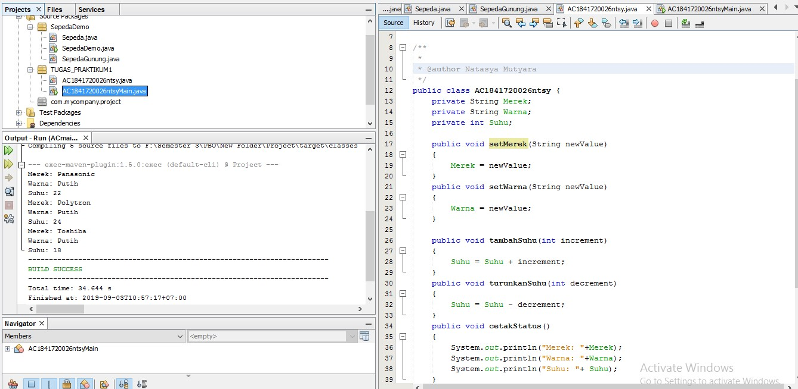

# Laporan Praktikum #1 - Pengantar Konsep PBO

## Kompetensi

  Setelah menempuh materi percobaan ini, mahasiswa mampu mengenal:
1. Perbedaan paradigma berorientasi objek dengan paradigma struktural
2. Konsep dasar PBO

## Ringkasan Materi

Dari pengantar Konsep PBO ini telah mempelajari lebih lanjut tentang cara membuat class, membuat objek, dan mengakses method dalam class
serta mendemonstrasikan fitur penting dalam PBO yaitu inheritance. 

## Percobaan

### Percobaan 1

Didalam percobaan ini, kita akan mendemonstrasikan bagaimana membuat class, membuat object,
kemudian mengakses method didalam class tersebut.
1. Buka Netbeans, buat project SepedaDemo.
2. Buat class Sepeda. Klik kanan pada package sepedademo – New – Java Class.
3. Ketikkan kode class Sepeda dibawah ini.

4. Kemudian pada class main, ketikkan kode berikut ini

Cocokkan hasilnya : 

Contoh link kode program : [ini contoh link ke kode program](../../src/1_Pengantar_Konsep_PBO/Sepeda.java)

### Percobaan 2

Penjelasan lebih detail tentang inheritance akan dibahas pada modul selanjutnya.
1. Masih pada project SepedaDemo. Buat class SepedaGunung.
2. Tambahkan kode extends Sepeda pada deklarasi class SepedaGunung. Kode extends ini
menandakan bahwa class SepedaGunung mewarisi class Sepeda.
3. Kemudian lengkapi kode SepedaGunung seperti berikut ini:

4. Kemudian pada class main, tambahkan kode berikut ini:5. Cocokkan hasilnya:

Contoh link kode program : [ini contoh link ke kode program](../../src/1_Pengantar_Konsep_PBO/SepedaGunung.java)

## Pertanyaan

1. Sebutkan dan jelaskan aspek-aspek yang ada pada pemrograman berorientasi objek!
2. Apa yang dimaksud dengan object dan apa bedanya dengan class?
3. Sebutkan salah satu kelebihan utama dari pemrograman berorientasi objek dibandingkan
dengan pemrograman struktural!
4. Pada class Sepeda, terdapat state/atribut apa saja?
5. Tambahkan atribut warna pada class Sepeda.
6. Mengapa pada saat kita membuat class SepedaGunung, kita tidak perlu membuat class nya dari
nol?

Jawaban :
1. Objek : suatu rangkaian dalam program yang terdiri dari state dan behaviour.

Class : blueprint atau prototype dari objek

Enkapsulasi:suatu mekanisme untuk menyembunyikan suatu proses dari kemungkinan    penyalahgunaan dari luar sistem dan sekaligus menyederhanakan penggunaan sistem tersebut

Inheritance: kemampuan sebuah class untuk menurunkan method yang dimilikinya kedalam class lain

Polimorfisme : kemampuan sebuah object untuk mempunyai banyak bentuk melalui satu cara yang sama

2. Objek adalah suatu rangkaian dalam program yang terdiri dari state dan behaviour.
Objek berbeda dengan class karena class adalah prototype dari objek.ambil contoh yaitu mobil. Mobil adalah class sementara mobil sport adalah objek.

3. Pada pemrograman terstruktur, program
dipecah kedalam sub-program atau fungsi. Sedangkan pada PBO, program dipecah kedalam objek,bdimana objek tersebut membungkus state dan method
4. Merek ,gear,kecepatan.
5. 
6. Karena pada dasarnaya sepeda dan sepedaGunung sama,maka kita tinggal wariskan saja dari class sepeda dan menambahkan fitur baru yaitu tambah suspensi dari class sepeda gunung. 

## Tugas

(silakan kerjakan tugas di sini beserta `screenshot` hasil kompilasi program. Jika ada rujukan ke file program, bisa dibuat linknya di sini.)

Contoh link kode program : [ini contoh link ke kode program](../../src/1_Pengantar_Konsep_PBO/AC1841720026ntsy.java)

Contoh link kode program : [ini contoh link ke kode program](../../src/1_Pengantar_Konsep_PBO/AC1841720026ntsyMain.java)

## Kesimpulan

Dari percobaan diatas, kita telah mendemonstrasikan bagaimana paradigma pemrograman
berorientasi objek dan mengimplementasikannya kedalam program sederhana. Kita juga telah
mendemonstrasikan salah satu fitur paling penting dari PBO yaitu inheritance, yaitu dalam hal
membuat class SepedaGunung.
Kita ketahui bahwa SepedaGunung pada dasarnya adalah sama dengan Sepeda (memiliki gear,
memiliki kecepatan, dapat menambah kecepatan, dapat mengerem, pindah gigi, dsb) namun ada
fitur tambahan yaitu tipe suspensi. Maka kita tidak perlu membuat class SepedaGunung dari nol,
kita extends atau wariskan saja dari class Sepeda, kemudian kita tinggal tambahkan fitur yang
sebelumnya belum ada di class Sepeda. Inilah salah satu kelebihan PBO yang tidak ada di
pemrograman struktural

## Pernyataan Diri

Saya menyatakan isi tugas, kode program, dan laporan praktikum ini dibuat oleh saya sendiri. Saya tidak melakukan plagiasi, kecurangan, menyalin/menggandakan milik orang lain.

Jika saya melakukan plagiasi, kecurangan, atau melanggar hak kekayaan intelektual, saya siap untuk mendapat sanksi atau hukuman sesuai peraturan perundang-undangan yang berlaku.

Ttd,

***Natasya Mutyara***
