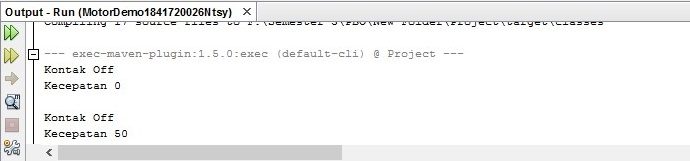
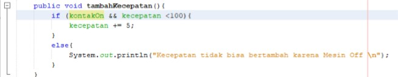

# Laporan Praktikum #3 - Enkapsulasi Pada Pemrograman Berorientasi Objek

## Kompetensi

  Setelah melakukan percobaan pada modul ini, mahasiswa memahami konsep:
1. Konstruktor
2. Akses Modifier
3. Atribut/method pada class
4. Intansiasi atribut/method
5. Setter dan getter
6. Memahami notasi pada UML Class Diagram

## Ringkasan Materi

## Percobaan

### Percobaan 1

Didalam percobaan enkapsulasi, buatlah class Motor yang memiliki atribut kecepatan dan kontakOn,
dan memiliki method printStatus() untuk menampilkan status motor. Seperti berikut
1. Buka Netbeans, buat project MotorEncapsulation.
2. Buat class Motor. Klik kanan pada package motorencapsulation – New – Java Class.
3. Ketikkan kode class Motor dibawah ini.

    

4. Kemudian pada class main, ketikkan kode berikut ini

    

Cocokkan hasilnya : 
    

Contoh link kode program Motor: [ini contoh link ke kode program Motor](../../src/3_Enkapsulasi/Motor.java)

Contoh link kode program MotorDemo: [ini contoh link ke kode program Motor Demo](../../src/3_Enkapsulasi/MotorDemo.java)

### Percobaan 2

1. Ubah cara kerja class motor sesuai dengan UML class diagram berikut.
2. Berdasarkan UML class diagram tersebut maka class Motor terdapat perubahan, yaitu:

   a. Ubah access modifier kecepatan dan kontakOn menjadi private

   b. Tambahkan method nyalakanMesin, matikanMesin, tambahKecepatan, kurangiKecepatan.

   Implementasi class Motor adalah sebagai berikut:

   

3. Kemudian pada class MotorDemo, ubah code menjadi seperti berikut:

   

4. Hasilnya dari class MotorDemo adalah sebagai berikut:

    

Contoh link kode program Motor: [ini contoh link ke kode program Motor](../../src/3_Enkapsulasi/Motor1841720026Ntsy.java)

Contoh link kode program MotorDemo: [ini contoh link ke kode program Motor Demo](../../src/3_Enkapsulasi/MotorDemo1841720026Ntsy.java)

## Pertanyaan

Pertanyaan
1. Pada class TestMobil, saat kita menambah kecepatan untuk pertama kalinya, mengapa
muncul peringatan “Kecepatan tidak bisa bertambah karena Mesin Off!”?
2. Mengapat atribut kecepatan dan kontakOn diset private?
3. Ubah class Motor sehingga kecepatan maksimalnya adalah 100!

Jawaban :
1. Karena status awal mesin masih mati sehingga kecepatan tidaka bisa bertambah
2. Agar proses yang terjadi didalamnya tidak ditampilkan
3. 

### Percobaan 3

1. Berikut ini UML class buatlah class Mahasiswa pada program:
2. Sama dengan percobaan 1 untuk membuat project baru

   a. Buka Netbeans, buat project KoperasiGetterSetter.

   b. Buat class Anggota. Klik kanan pada package koperasigettersetter – New – JavaClass.

   c. Ketikkan kode class Anggota dibawah ini.

   

3. Selanjutnya buatlah class KoperasiDemo untuk mencoba class Anggota.

   

4. Hasil dari main method pada langkah ketiga adalah

   

Contoh link kode program Motor: [ini contoh link ke kode program Motor](../../src/3_Enkapsulasi/Motor1841720026Ntsy.java)

Contoh link kode program MotorDemo: [ini contoh link ke kode program Motor Demo](../../src/3_Enkapsulasi/MotorDemo1841720026Ntsy.java)

### Percobaan 4

1. Langkah pertama percobaan 4 adalah ubah class KoperasiDemo seperti berikut
2. Hasil dari program tersebut adalah sebagai berikut
3. Ubah class Anggota menjadi seperti berikut
4. Selanjutnya ubah class KoperasiDemo sebagai berikut
5. Hasil dari program tersebut adalah sebagai berikut

   

   

   Contoh link kode program : [ini contoh link ke kode program Motor Demo](../../src/3_Enkapsulasi/Anggota1841720026Ntsy.java)

   Contoh link kode program : [ini contoh link ke kode program Motor Demo](../../src/3_Enkapsulasi/KoperasiDemo1841720026Ntsy.java)

## Pertanyaan
1. Apa yang dimaksud getter dan setter?
2. Apa kegunaan dari method getSimpanan()?
3. Method apa yang digunakan untk menambah saldo?
4. Apa yand dimaksud konstruktor?
5. Sebutkan aturan dalam membuat konstruktor?
6. Apakah boleh konstruktor bertipe private?
7. Kapan menggunakan parameter dengan passsing parameter?
8. Apa perbedaan atribut class dan instansiasi atribut?
9. Apa perbedaan class method dan instansiasi method?

Jawaban :

1. Getter adalah public method dan memiliki tipe data return, yang berfungsi untuk mendapatkan nilai dari atribut private. 
Setter adalah public method yang tidak memiliki tipe data return, yang berfungsi untuk memanipulasi nilai dari atribut private. 
2. untuk menampilkan simpanan
3. Setor
4. method khusus yang akan dieksekusi pada saat pembuatan objek (instansiasi).
5. 
   a)	Nama konstruktor harus sama dengan nama class 
   b)	Selalu memiliki modifier access public
   c)	Konstruktor hanya jalan saat proses instansiasi
   d)	Konstruktor tidak memiliki tipe data method
   e)	Tidak bisa memiliki return
6. Boleh
7. Saat data 
8. - cara akses 
   Jika instansiasi atribut objeknya harus diinstansiasikan untuk atribut tidak perlu dinstansiasikan,langsung nama class nya   
9.  Jika instansiasi method objeknya harus diinstansiasikan untuk method tidak perlu dinstansiasikan,langsung nama class nya

## Kesimpulan

Dari percobaan diatas, telah dipelajari kosep dari enkapsulasi, kontruktor, access modifier yang
terdiri dari 4 jenis yaitu public, protected, default dan private. Konsep atribut atau method class
yang ada di dalam blok code class dan konsep instansiasi atribut atau method. Cara penggunaan
getter dan setter beserta fungsi dari getter dan setter. Dan juga telah dipelajari atau memahami
notasi UML

## Tugas 
1. Cobalah program dibawah ini dan tuliskan hasil outputnya

   

   Contoh link kode program : [ini contoh link ke kode program Motor Demo](../../src/3_Enkapsulasi/EncapText1841720026Ntsy.java)

2. Pada program diatas, pada class EncapTest kita mengeset age dengan nilai 35,
   
 namun pada
saat ditampilkan ke layar nilainya 30, jelaskan mengapa.
 
 Contoh link kode program : [ini contoh link ke kode program Motor Demo](../../src/3_Enkapsulasi/EncapDemo1841720026Ntsy.java)
3.	Ubah program diatas agar atribut age dapat diberi nilai maksimal 30 dan minimal 18.

4.	Pada sebuah sistem informasi koperasi simpan pinjam, terdapat class Anggota yang memiliki atribut antara lain nomor KTP, nama, limit peminjaman, dan jumlah pinjaman. Anggota dapat meminjam uang dengan batas limit peminjaman yang ditentukan. Anggota juga dapat mengangsur pinjaman. Ketika Anggota tersebut mengangsur pinjaman, maka jumlah pinjaman akan berkurang sesuai dengan nominal yang diangsur. Buatlah class Anggota tersebut, berikan atribut, method dan konstruktor sesuai dengan kebutuhan. Uji dengan TestKoperasi berikut ini untuk memeriksa apakah class Anggota yang anda buat telah sesuai dengan yang diharapkan.

5.	Modifikasi soal no. 4 agar nominal yang dapat diangsur minimal adalah 10% dari jumlah pinjaman saat ini. Jika mengangsur kurang dari itu, maka muncul peringatan “Maaf, angsuran harus 10% dari jumlah pinjaman”.

## Pernyataan Diri

Saya menyatakan isi tugas, kode program, dan laporan praktikum ini dibuat oleh saya sendiri. Saya tidak melakukan plagiasi, kecurangan, menyalin/menggandakan milik orang lain.

Jika saya melakukan plagiasi, kecurangan, atau melanggar hak kekayaan intelektual, saya siap untuk mendapat sanksi atau hukuman sesuai peraturan perundang-undangan yang berlaku.

Ttd,

***Natasya Mutyara***
