# Laporan Praktikum #4 - Relasi Kelas

## Kompetensi

    Setelah menempuh pokok bahasan ini, mahasiswa mampu:
1. Memahami konsep relasi kelas;
2. Mengimplementasikan relasi has‑a dalam program.

## Ringkasan Materi

## Percobaan

### Percobaan 1
    a.  Perhatikan diagram class berikut:

    b.  Buka project baru di Netbeans dan buat package dengan format berikut: <identifier>.relasiclass.percobaan1 (ganti dengan identitas anda atau nama domain), Contoh: ac.id.polinema, jti.polinema, dan sebagainya).

    c.  Buatlah class Processor dalam package tersebut. 
        public class Processor { 
        }
    
    d.  Tambahkan atribut merk dan cache pada class Processor dengan akses modifier 
        private .
        private String merk;
        private double cache;

    e.  Buatlah constructor default untuk class Processor.

    f.  Buatlah constructor untuk class Processor dengan parameter merk dan cache.

    g.  Implementasikan setter dan getter untuk class Processor.

    h.  Implementasikan method info() seperti berikut:
        public void info() {
        System.out.printf("Merk Processor = %s\n", merk);
        System.out.printf("Cache Memory = %.2f\n", cache);
        }

    i.  Kemudian buatlah class Laptop di dalam package yang telah anda buat.

    j. Tambahkan atribut merk dengan tipe String dan proc dengan tipe Object Processor
        private String merk;
        private Processor proc;

    k.  Buatlah constructor default untuk class Laptop .

    l.  Buatlah constructor untuk class Laptop dengan parameter merk dan proc .

    m.  Selanjutnya implementasikan method info() pada class Laptop sebagai berikut
        public void info() {
        System.out.println("Merk Laptop = " + merk);
        proc.info();
        }

    n.  Pada package yang sama, buatlah class MainPercobaan1 yang berisi method
    main().

    o.  Deklarasikan Object Processor dengan nama p kemudian instansiasi dengan informasi
    atribut Intel i5 untuk nilai merk serta 3 untuk nilai cache .
        Processor p = new Processor("Intel i5", 3);

    p.  Kemudian deklarasikan serta instansiasi Objek Laptop dengan nama L dengan informasi
    atribut Thinkpad dan Objek Processor yang telah dibuat.

    q.  Panggil method info() dari Objek L.
        L.info();

    r.  Tambahkan baris kode berikut
        Processor p1 = new Processor();
        p1.setMerk("Intel i5");
        p1.setCache(4);
        Laptop L1 = new Laptop();
        L1.setMerk("Thinkpad");
        L1.setProc(p1);
        L1.info();

    s.  Compile kemudian run class MainPercobaan1, akan didapatkan hasil seperti berikut:

    Hasil :

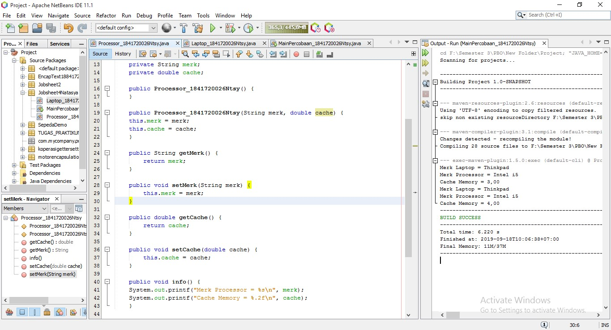

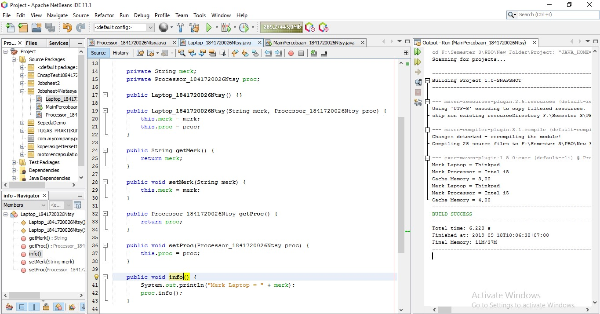

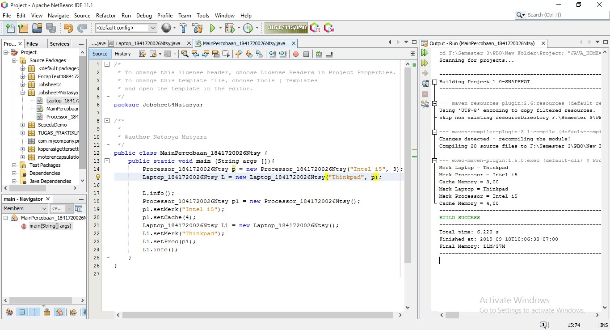

### Pertanyaan

Berdasarkan percobaan 1, jawablah pertanyaan‑pertanyaan yang terkait:

1. Di dalam class Processor dan class Laptop , terdapat method setter dan getter untuk masing‑masing atributnya. Apakah gunanya method setter dan getter tersebut ?

    Jawaban :
    untuk memberi nilai dan mendapatkan nilai pada suatu variabel atau class dengan contructor default

2. Di dalam class Processor dan class Laptop, masing‑masing terdapat konstruktor default dan konstruktor berparameter. Bagaimanakah beda penggunaan dari kedua jenis konstruktor tersebut ?

    Jawaban : 
    Untuk memberi nilai menggunakan setter bila konstruktor default, tetapi jika kita menggunakan konstruktor berparameter, kita hanya perlu memberi nilai di parameter pada objek di class main.

3. Perhatikan class Laptop, di antara 2 atribut yang dimiliki (merk dan proc), atribut manakah yang bertipe object ?

    Jawaban : proc, karena inisialisasi tipe variabel ditandai dengan nama object.

4. Perhatikan class Laptop, pada baris manakah yang menunjukan bahwa class Laptop memiliki relasi dengan class Processor ?

    Jawaban : 
    terdapat parameter yang menggunakan object Processor yang telah diinisiasi sebelumnya.

5. Perhatikan pada class Laptop , Apakah guna dari sintaks proc.info() ?

    Jawaban : 
    proc.Info(), merupakan syntax yang digunakan untuk menjalankan method Info() pada class Processor.

6. Pada class MainPercobaan1, terdapat baris kode:

    Laptop l = new Laptop("Thinkpad", p);.
    Apakah p tersebut ? 
    
    Dan apakah yang terjadi jika baris kode tersebut diubah menjadi:
    
    Laptop l = new Laptop("Thinkpad", new Processor("Intel i5", 3));
    
    Bagaimanakah hasil program saat dijalankan, apakah ada perubahan ?

    Jawaban : 
    p adalah object dari class Processor yang telah diinstansiasi, kode program tersebut memiliki perbedaan pada instansiasi dalam bentuk variabel object, bila pada object tidak perlu diinstansiasi kedalam variabel lain 

## Percobaan 2

Perhatikan diagram class berikut yang menggambarkan sistem rental mobil. Pelanggan bisa
menyewa mobil sekaligus sopir. Biaya sopir dan biaya sewa mobil dihitung per hari.

    a. Tambahkan package
        <identifier>.relasiclass.percobaan2.
    b. Buatlah class Mobil di dalam package tersebut.
    
    c. Tambahkan atribut merk tipe String dan biaya 
        tipe int dengan akses modifier
        private.

    d. Tambahkan constructor default serta setter dan getter.

    e. Implementasikan method hitungBiayaMobil
        public int hitungBiayaMobil(int hari) {
        return biaya * hari;
        }

    f. Tambahkan class Sopir dengan atribut nama tipe String dan biaya tipe int dengan akses
        modifier private berikut dengan constructor default.

    g. Implementasikan method hitungBiayaSopir
        public int hitungBiayaSopir(int hari) {
        return biaya * hari;
        }

    h. Tambahkan class Pelanggan dengan constructor default.

    i. Tambahkan atribut‑atribut dengan akses modifier private berikut:
        Atribut Tipe
        nama String
        mobil Mobil
        sopir Sopir
        hari int

    j. Implementasikan setter dan getter.

    k. Tambahkan method hitungBiayaTotal
        public int hitungBiayaTotal() {
        return mobil.hitungBiayaMobil(hari) +
        sopir.hitungBiayaSopir(hari);
        }

    l. Buatlah class MainPercobaan2 yang berisi method main(). Tambahkan baris kode
    berikut:
        Mobil m = new Mobil();
        m.setMerk("Avanza");
        m.setBiaya(350000);
        Sopir s = new Sopir();
        s.setNama("John Doe");
        s.setBiaya(200000);
        Pelanggan p = new Pelanggan();
        p.setNama("Jane Doe");
        p.setMobil(m);
        p.setSopir(s);
        p.setHari(2);
        System.out.println("Biaya Total = " +
        p.hitungBiayaTotal());

    m. Compile dan jalankan class MainPercobaan2, dan perhatikan hasilnya!

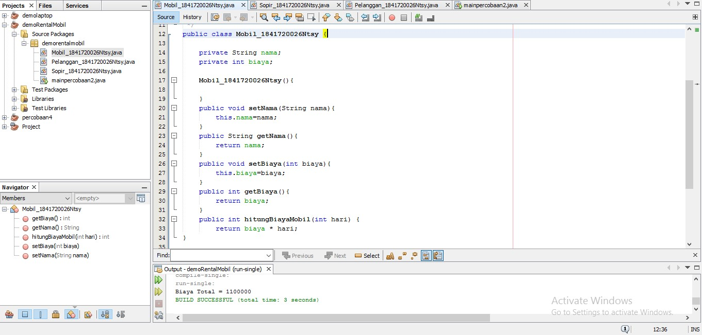

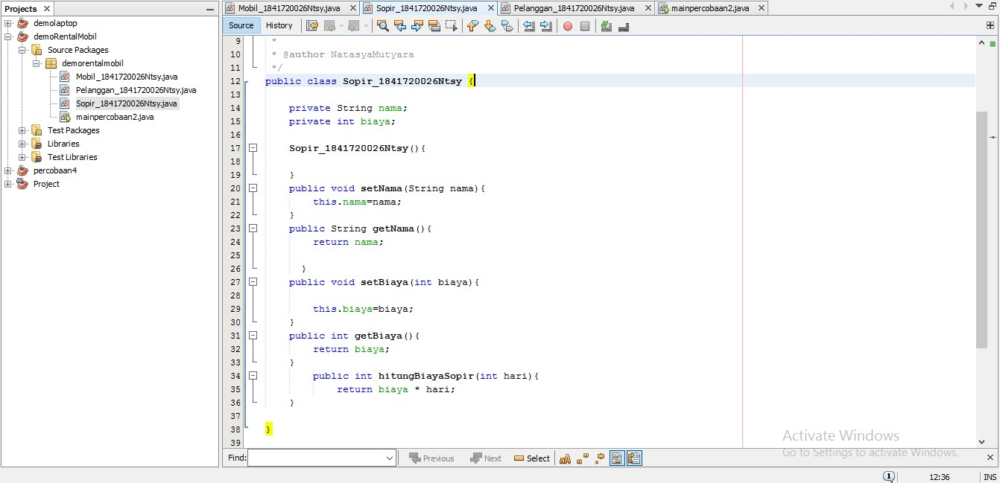

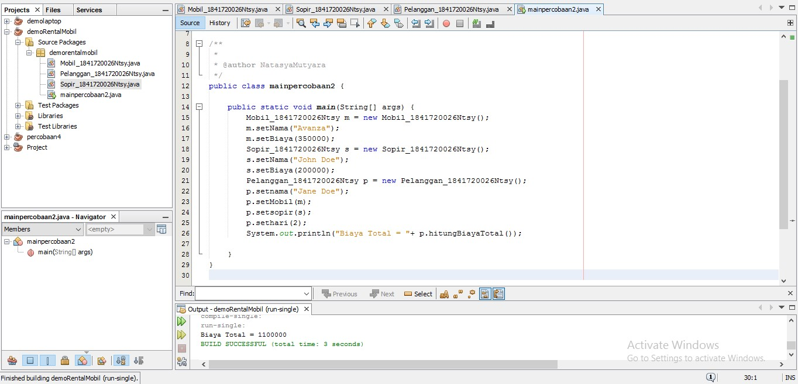

### Pertanyaan
1. Perhatikan class Pelanggan. Pada baris program manakah yang menunjukan bahwa class Pelanggan memiliki relasi dengan class Mobil dan class Sopir ?
    
    Jawaban : Relasiterdapat pada

    private String nama;

    private int hari;

    private Sopir_1841720026Ntsy sopir;
    
    private Mobil_1841720026Ntsy mobil;

2. Perhatikan method hitungBiayaSopir pada class Sopir, serta method hitungBiayaMobil pada class Mobil. Mengapa menurut Anda method tersebut harus memiliki argument hari ?

    Jawaban :

    Karena Hari memiliki relasi dengan mobil dan sopir, yaitu untuk menghitung biaya total

3. Perhatikan kode dari class Pelanggan. Untuk apakah perintah
    
    mobil.hitungBiayaMobil(hari) dan sopir.hitungBiayaSopir(hari) ?

    Jawaban :

    digunakan untuk menjumlahkan biaya mobil yang diambil dari harga sopir dikali dengan hari lalu yang dijumlahkan dengan biaya sopir yang diambil dari harga sopir dikali hari.

4. Perhatikan class MainPercobaan2. Untuk apakah 
    sintaks p.setMobil(m) dan  p.setSopir(s) ?

    Jawaban : Untuk memberi nilai dari namaMobil dan namaSopir yang ada pada objek pelanggan

5. Perhatikan class MainPercobaan2. Untuk apakah proses     p.hitungBiayaTotal( tersebut ?

    Jawaban : untuk menghitung jumlah biaya yang di total dari biaya mobil dan biaya sopir

6. Perhatikan class MainPercobaan2, coba tambahkan pada baris terakhir dari method
main dan amati perubahan saat di‑run!
System.out.println(p.getMobil().getMerk());
Jadi untuk apakah sintaks p.getMobil().getMerk() yang ada di dalam method main
tersebut?

    Jawaban : perintah tersebut digunakan untuk menggembalikan atau me return nilai atribut dari method  getMerk() pada class Mobil melalui objek pelanggan, atau setelah me return object Mobil pada class pelanggan, object mobil akan me return String getMerk() pada class mobil

## Percobaan 3
Pada percobaan‑percobaan sebelumnya, relasi dalam class dinyatakan dalam one‑to‑one. Tetapi ada
kalanya relasi class melibatkan lebih dari satu. Hal ini disebut dengan multiplicity. Untuk relasi
lebih rinci mengenai multiplicity, dapat dilihat pada tabel berikut.

    a. Sebuah Kereta Api dioperasikan oleh Masinis serta seorang Asisten Masinis. Baik Masinis
    maupun Asisten Masinis keduanya merupakan Pegawai PT. Kereta Api Indonesia. Dari
    ilustrasi cerita tersebut, dapat digambarkan dalam diagram kelas sebagai berikut:

    b. Perhatikan dan pahami diagram kelas tersebut, kemudian bukalah IDE anda!

    c. Buatlah package <identifier>.relasiclass.percobaan3, kemudian tambahkan class Pegawai
    d. Tambahkan atribut‑atribut ke dalam class Pegawai
        private String nip;
        private String nama;
    e. Buatlah constructor untuk class Pegawai dengan parameter nip dan nama.

    f. Tambahkan setter dan getter untuk masing‑masing atribut.

    g. Implementasikan method info() dengan menuliskan baris kode berikut:

        public String info() { String info = "";
        info += "Nip: " + this.nip + "\n";
        info += "Nama: " + this.nama + "\n";
        return info;
        }
    h. Buatlah class KeretaApi berdasarkan diagram class.

    i. Tambahkan atribut‑atribut pada class KeretaApi berupa nama, kelas, masinis, dan
        asisten.
        private String nama;
        private String kelas;
        private Pegawai masinis;
        private Pegawai asisten;

    j. Tambahkan constructor 3 parameter (nama, kelas, masinis) serta 4 parameter (nama, kelas, masinis, asisten).

    k. Tambahkan setter dan getter untuk atribut‑atribut yang ada pada class KeretaApi .

    l. Kemudian implementasikan method info()
        public String info() {
        String info = "";
        info += "Nama: " + this.nama + "\n";
        info += "Kelas: " + this.kelas + "\n";
        info += "Masinis: " + this.masinis.info() + "\n";
        info += "Asisten: " + this.asisten.info() + "\n";
        return info;
        }

    m. Buatlah sebuah class MainPercobaan3 dalam package yang sama.

    n. Tambahkan method main() kemudian tuliskan baris kode berikut.

        Pegawai masinis = new Pegawai("1234", "Spongebob
        Squarepants");
        Pegawai asisten = new Pegawai("4567", "Patrick Star");
        KeretaApi keretaApi = new KeretaApi("Gaya Baru", "Bisnis",
        masinis, asisten);
        System.out.println(keretaApi.info());

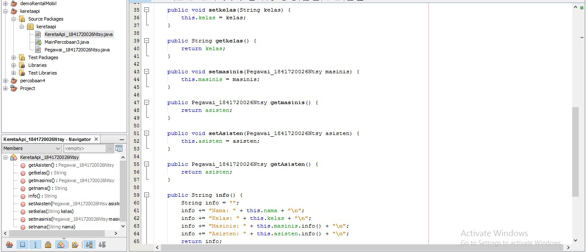

Contoh link kode program : [ini contoh link ke kode program ](../../src/4_Relasi_Class/KeretaApi_1841720026Ntsy.java)

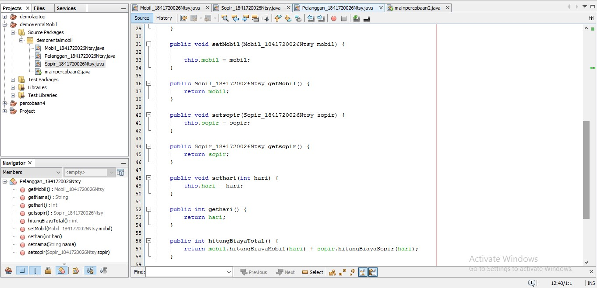

Contoh link kode program : [ini contoh link ke kode program ](../../src/4_Relasi_Class/Pelanggan_1841720026Ntsy.java)

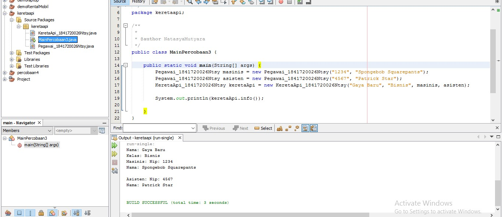

Contoh link kode program : [ini contoh link ke kode program ](../../src/4_Relasi_Class/MainPercobaan3_1841720026Ntsy.java)

### Pertanyaan

1. Di dalam method info() pada class KeretaApi, baris this.masinis.info() dan
this.asisten.info() digunakan untuk apa ?

    Jawaban : untuk memanggil method Info yang berada di class Pegawai melalui object masinis dan asisten

2. Buatlah main program baru dengan nama class MainPertanyaan pada package yang
sama. Tambahkan kode berikut pada method main() !

    Pegawai masinis = new Pegawai("1234", "Spongebob
    Squarepants");
    KeretaApi keretaApi = new KeretaApi("Gaya Baru", "Bisnis",
    masinis);
    System.out.println(keretaApi.info());

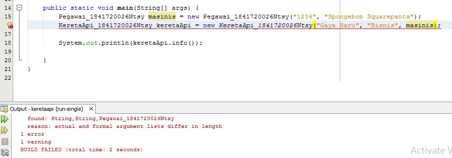
Hasilnya Error

3. Apa hasil output dari main program tersebut ? Mengapa hal tersebut dapat terjadi ?

4. Perbaiki class KeretaApi sehingga program dapat berjalan !

    public String info() {
            String info = "";
            info += "Nama: " + this.nama + "\n";
            info += "Kelas: " + this.kelas + "\n";
            info += "Masinis: " + this.masinis.info() + "\n";
            if (asisten != null){
                info +="Asisten : \n"+this.asisten.info()+"\n";
            }
            return info;
        }

### Percobaan 4
    a. Perhatikan dan pahami diagram class tersebut.

    b. Buatlah masing‑masing class Penumpang, Kursi dan Gerbong sesuai rancangan tersebut pada package <identifier>.relasiclass.percobaan4.

    c. Tambahkan method info() pada class Penumpang
        public String info() {
        String info = "";
        info += "Ktp: " + ktp + "\n";
        info += "Nama: " + nama + "\n";
        return info;
        }

    d. Tambahkan method info() pada class Kursi
        public String info() {
        String info = "";
        info += "Nomor: " + nomor + "\n";
        if (this.penumpang != null) {
        info += "Penumpang: " + penumpang.info() + "\n";
        }
        return info;
        }

    e. Pada class Gerbong buatlah method initKursi() dengan akses private.
        private void initKursi() {
        for (int i = 0; i < arrayKursi.length; i++) {
        this.arrayKursi[i] = new Kursi(String.valueOf(i + 1));
        }
        }

    f. Panggil method initKursi() dalam constructor Gerbong sehingga baris kode menjadi
    berikut:
        public Gerbong(String kode, int jumlah) {
        this.kode = kode;
        this.arrayKursi = new Kursi[jumlah];
        this.initKursi();
        }

    g. Tambahkan method info() pada class Gerbong
        public String info() {
        String info = "";
        info += "Kode: " + kode + "\n";
        for (Kursi kursi : arrayKursi) {
        info += kursi.info();
        }
        return info;
        }

    h. Implementasikan method untuk memasukkan penumpang sesuai dengan nomor kursi.
        public void setPenumpang(Penumpang penumpang, int nomor) {
        this.arrayKursi[nomor - 1].setPenumpang(penumpang);
        }

    i. Buatlah class MainPercobaan4 yang berisi method main(). Kemudian tambahkan baris berikut!
        Penumpang p = new Penumpang("12345", "Mr. Krab");
        Gerbong gerbong = new Gerbong("A", 10);
        gerbong.setPenumpang(p, 1);
        System.out.println(gerbong.info());

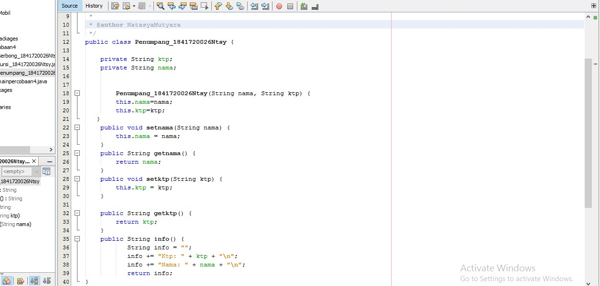

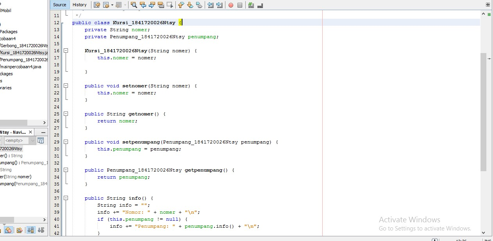

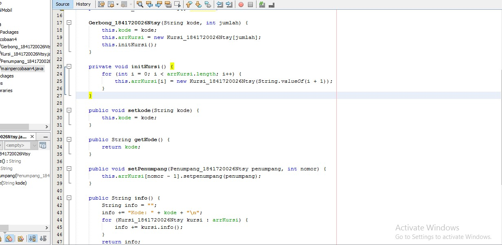

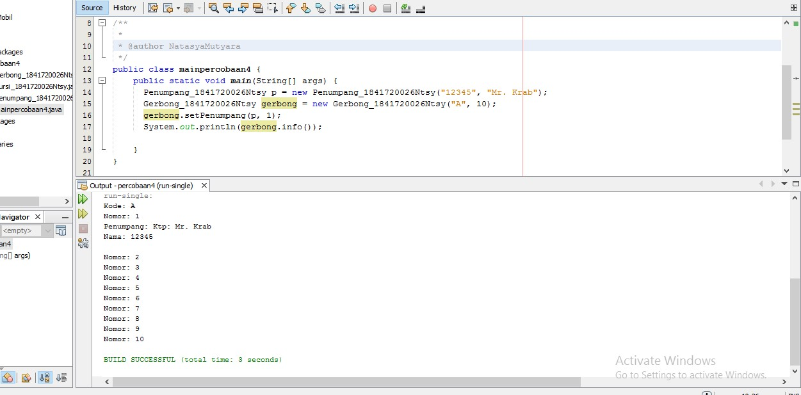

### Pertanyaan
1.	Pada main program dalam class MainPercobaan4, berapakah jumlah kursi dalam Gerbong A?

    Jawab : 10 karena pada instansiasi new Gerbong atau pada output perulangan “Nomer : 10” 

2.	Perhatikan potongan kode pada method info() dalam class Kursi. Apa maksud kode tersebut

 
    Jawab : Digunakan untuk menampilkan kursi yang terisi oleh penumpang, tapi bila penumpang tidak bernilai (null), maka if tidak dijalankan atau berarti kursi tersebut masih kosong

3.	Mengapa pada method setPenumpang() dalam class Gerbang, nilai nomer dikurangi dengan angka 1?

    Jawab : karena index array selalu dimulai dari 0, oleh karena itu nilai nomer harus dikurangi 1 agar array di index 0 atau di index pertama dapat terisi

4.	Intansiasi object baru budi dengan tipe Penumpang, kemudian masukan object baru tersebut pada gerbong dengan gerbong.setPenumpang(budi,1). Apakah yang terjadi?

    Jawab : 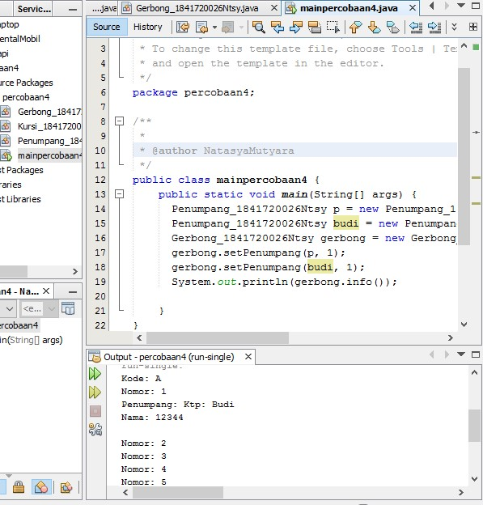

5.	Modifikasi program sehingga, tidak diperkenankan untuk menduduki kursi yang sudah ada penumpang lain!
    
    Jawab :

## TUGAS

Buatlah sebuah studi kasus, rancang dengan class diagram, kemudian implementasikan ke dalam
program! Studi kasus harus mewakili relasi class dari percobaan‑percobaan yang telah dilakukan
pada materi ini, setidaknya melibatkan minimal 4 class (class yang berisi main tidak dihitung).