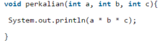
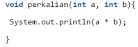
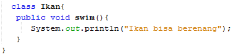
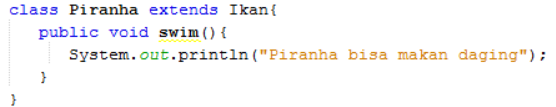
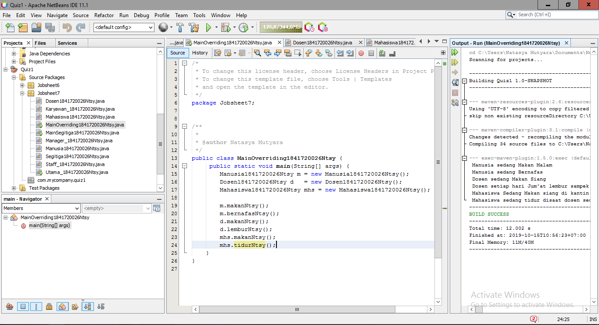

# Laporan Praktikum #7 - OVERLOADING DAN OVERRIDING

## Kompetensi
Setelah menempuh pokok bahasan ini, mahasiswa mampu :

a. Memahami konsep overloading dan overriding,

b. Memahami perbedaan overloading dan overriding,

c. Ketepatan dalam mengidentifikasi method overriding dan overloading

d. Ketepatan dalam mempraktekkan instruksi pada jobsheet

e. Mengimplementasikan method overloading dan overriding.

## Ringkasan Materi
    Dari Materi ini dijelaskan mengenai overloading dan overriding serta kita dapat memahami apa itu perbedaannya da dapat mengidentifikasi method nya. 
    setelah dapat memahami overloading dan overriding kemudian dapat mengimplementasikannya.

## Praktikum

### Percobaan 1

Untuk kasus contoh berikut ini, terdapat tiga kelas, yaitu Karyawan, Manager, dan Staff.
Class Karyawan merupakan superclass dari Manager dan Staff dimana subclass Manager dan
Staff memiliki method untuk menghitung gaji yang berbeda.

- Karyawan

    

    

    Contoh link kode program : [ini contoh link ke kode program](../../src/7_Overriding_dan_Overloading/Karyawan_1841720026Ntsy.java)

- Staff

    

    

    Contoh link kode program : [ini contoh link ke kode program](../../src/7_Overriding_dan_Overloading/Staff_1841720026Ntsy.java)

- Manager

    

    Contoh link kode program : [ini contoh link ke kode program](../../src/7_Overriding_dan_Overloading/Manager_1841720026Ntsy.java)

- Utama

    

    

    Contoh link kode program : [ini contoh link ke kode program](../../src/7_Overriding_dan_Overloading/Utama_1841720026Ntsy.java)

## Latihan

1 Dari source coding diatas terletak dimanakah overloading?

Jawaban : 
    
 
2 Jika terdapat overloading ada berapa jumlah parameter yang berbeda?
Jawaban : Ada 1 paramater berbeda yaitu “int c“

3 Dari source coding diatas terletak dimanakah overloading?

Jawaban : 
  
4 Jika terdapat overloading ada berapa tipe parameter yang berbeda?
Ada 2, yaitu “double a” dan “double b”

5 Dari source coding diatas terletak dimanakah overriding?
 
Jawaban : 
          

6 Jabarkanlah apabila sourcoding diatas jika terdapat overriding?

Jawaban : Deklarasi method pada subclass Piranha sama dengan method superclass Ikan

## Tugas

1. Overloading
- 

- Contoh link kode program : [ini contoh link ke kode program](../../src/7_Overriding_dan_Overloading/Segitiga1841720026Ntsy.java)

- 

- Contoh link kode program : [ini contoh link ke kode program](../../src/7_Overriding_dan_Overloading/MainSegitiga1841720026Ntsy.java)

2. Overriding
- 
- Contoh link kode program : [ini contoh link ke kode program](../../src/7_Overriding_dan_Overloading/Manusia1841720026Ntsy.java)

- 
- Contoh link kode program : [ini contoh link ke kode program](../../src/7_Overriding_dan_Overloading/Dosen1841720026Ntsy.java)

- 
- Contoh link kode program : [ini contoh link ke kode program](../../src/7_Overriding_dan_Overloading/Mahasiswa1841720026Ntsy.java)

- 
- Contoh link kode program : [ini contoh link ke kode program](../../src/7_Overriding_dan_Overloading/MainOverriding1841720026Ntsy.java)

## Kesimpulan
Kesimpulan dari tugas berikut adalah Overloading
adalah menuliskan kembali method dengan nama yang sama pada suatu class. Tujuannya dapat memudahkan penggunaan/pemanggilan method dengan fungsionalitas yang mirip. dan Overriding adalah Sublass yang berusaha memodifkasi tingkah laku yang diwarisi dari superclass. Tujuannya subclass dapat memiliki tingkah laku yang lebih spesifik sehingga dapat dilakukan dengan cara mendeklarasikan kembali method milik parent class di subclass.

## Pernyataan Diri

Saya menyatakan isi tugas, kode program, dan laporan praktikum ini dibuat oleh saya sendiri. Saya tidak melakukan plagiasi, kecurangan, menyalin/menggandakan milik orang lain.

Jika saya melakukan plagiasi, kecurangan, atau melanggar hak kekayaan intelektual, saya siap untuk mendapat sanksi atau hukuman sesuai peraturan perundang-undangan yang berlaku.

Ttd,

***Natasya Mutyara***
