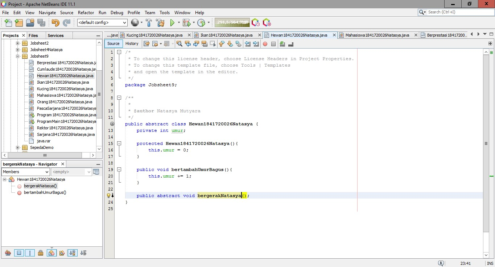

# Laporan Praktikum #9 - Abstract Class dan Interface

## Kompetensi

Setelah menyelesaikan lembar kerja ini mahasiswa diharapkan mampu: 

1. Menjelaskan maksud dan tujuan penggunaan Abstract Class; 
2. Menjelaskan maksud dan tujuan penggunaan Interface; 
3. Menerapkan Abstract Class dan Interface di dalam pembuatan program. 

## Ringkasan Materi

- Abstract Class Abstract Class adalah class yang tidak dapat diinstansiasi namun dapat di-extend. 
  Abstract class baru dapat dimanfaatkan ketika ia di-extend. 

- Kegunaan Abstract : Menggambarkan sesuatu yang bersifat umum, yang hanya bisa berfungsi setelah ia dideskripsikan ke dalam bentuk yang lebih spesifik. 

- Interface Interface adalah struktur data yang hanya berisi abstract methods. Tidak ada apa-apa selain method abstract pada interface, 
  termasuk atribut getter dan setter. 

- Kegunaan Interface : Bertindak seperti semacam kontrak/syarat yang HARUS dipenuhi bagi suatu class agar class tersebut dapat dianggap sebagai ‘sesuatu yang lain’. 

## Percobaan

### Percobaan 1
1. Buat folder baru
2. Pada package pbominggu9, tambahkan package baru dengan cara klik kanan nama package 
New  Java Package…
3. Beri nama package tersebut dengan nama abstractclass. Semua class yang dibuat pada
percobaan 1 ini diletakkan pada package yang sama, yaitu package abstractclass ini,
4. Pada package baru tersebut tambahkan class baru.
5. Beri nama class baru tersebut, yaitu class Hewan.
6. Pada class Hewan tersebut, ketikkan kode berikut ini.
Class Hewan tersebut adalah class abstract berisi property dan method biasa, ditambah sebuah
method abstract bernama bergerak(). Method tersebut didepannya terdapat kata kunci abstract
dan tidak memiliki badan fungsi. Method ini nantinya akan di-override oleh class mana saja yang
menjadi class turunan dari class Hewan tersebut.
7. Dengan cara yang sama, buatlah class dengan nama Kucing yang meng-extend class Hewan. Di
dalam class Kucing tersebut, setelah Anda menuliskan kode seperti di bawah, maka akan muncul
ikon lampu peringatan. Klik lampu tersebut dan kemudian pilih implement all abstract
methods.
8. Maka akan secara otomatis dibuatkan fungsi yang meng-override fungsi abstract bergerak()
yang ada pada class hewan.
9. Ubahlah badan fungsi tersebut dengan mengganti kode didalamnya menjadi seperti berikut.
10. Dengan cara yang sama seperti ketika Anda membuat class Kucing, buatlah class Hewan baru
bernama Ikan dan buatlah kodenya seperti pada gambar dibawah.
11. Selanjutnya, buatlah class biasa baru yang bernama class Orang. Class ini adalah class yang
menjadi pengguna dari class abstract Hewan yang sudah dibuat sebelumnya. Ketikkan pada class
Orang tersebut, baris-baris kode seperti di bawah.
12. Terakhir, buatlah sebuah Main Class baru di dalam package yang sama. Beri nama class baru
tersebut dengan nama class Program. Ketikkan didalamnya seperti kode di bawah ini.
13. Jalankan class tersebut dengan cara klik kanan pada class Program kemudian pilih Run File
(Shift + F6).
14. Perhatikan dan amati hasilnya!
15. Pertanyaan diskusi:
Bolehkah apabila sebuah class yang meng-extend suatu abstract class tidak
mengimplementasikan method abstract yang ada di class induknya? Buktikan!

- Class Hewan

[Source code Hewan](../../src/9_Abstract_Class_dan_Interface/Hewan1841720026Natasya.java) 

- Class Ikan

[Source code ikan](../../src/9_Abstract_Class_dan_Interface/Ikan1841720026Natasya.java) 

- Class Kucing

[Source code kucing](../../src/9_Abstract_Class_dan_Interface/Kucing1841720026Natasya.java) 

- Class Orang
[Source code Orang](../../src/9_Abstract_Class_dan_Interface/Orang1841720026Natasya.java) 

## Pertanyaan 1

- Bolehkah apabila sebuah class yang meng-extend suatu abstract class tidak 
  mengimplementasikan method abstract yang ada di class induknya? Buktikan

  Jawab : Tidak boleh, karena kelas turunan HARUS mengoverride method yang ada dari kelas induk dan bila tidak maka akan muncul eror, 
misalnya di kelas ‘Kucing’ dihapus method bergerak(), makan akan muncul eror

### Percobaan 2
1. Pada project yang sama, buatlah sebuah package baru bernama interfacelatihan.
2. Pada package yang baru dibuat tersebut, tambahkan sebuah interface baru dengan cara klik
kanan pada package  New  Java Interface… Beri nama interface baru tersebut dengan nama
ICumlaude.Page 10 of 17
3. Pada interface ICumlaude tersebut, tambahkan 2 abstract methods bernama lulus() dan
meraihIPKTinggi().
4. Berikutnya, buatlah sebuah class baru bernama Mahasiswa dengan baris-baris kode seperti
dibawah ini.
5. Selanjutnya, buatlah class baru bernama Sarjana yang merupakan turunan dari class
Mahasiswa. Class Sarjana tersebut dibuat meng-implements interface ICumlaude yang
sudah dibuat sebelumnya tadi. Ketikkan kode di bawah pada class tersebut. Tips: Anda dapat
menggunakan fasilitas override otomatis dengan cara yang sama yaitu dengan mengklik ikon
lampu peringatan seperti pada percobaan 1.
6. Selanjutnya sesuaikan isi dari method lulus() dan meraihIPKTinggi() agar sama dengan baris
kode di bawah.
Perhatikan pada baris kode di atas, class Sarjana meng-extend class Mahasiswa, ini berarti,
Sarjana adalah Mahasiswa sementara itu agar semua objek dari class Sarjana ini nantinya dapat
disebut sebagai Cumlaude maka ia harus meng-implements interface ICumlaude.
7. Kemudian dengan cara yang sama buatlah class baru bernama PascaSarjana dengan baris kode
seperti di bawah ini.
8. Lalu buatlah sebuah class baru bernama Rektor. Class ini adalah class yang memanfaatkan classclass Mahasiswa yang telah dibuat sebelumnya.
9. Terakhir, buatlah sebuah class baru bernama Program yang diletakkan pada package yang
sama dengan class-class percobaan 2. Tambahlan baris kode berikut ini
10. Pada baris kode tersebut, apabila Anda mengetikkan semua class dengan benar, maka akan
terdapat error dan class Program tidak dapat dieksekusi. Perbaikilah kode Anda agar program
yang Anda buat mengeluarkan output seperti berikut ini:

- Class Mahasiswa

[Source code Mahasiswa](../../src/9_Abstract_Class_dan_Interface/mahasiswa1841720026Natasya.java) 

- Class Cumlaude

[Source code Cumlaude](../../src/9_Abstract_Class_dan_Interface/Mahasiswa1841720026Natasya.java) 

- Class Berprestasi

[Source code Berprestasi](../../src/9_Abstract_Class_dan_Interface/Berprestasi1841720026Natasya.java) 

- Class Sarjana
[Source code Sarjana](../../src/9_Abstract_Class_dan_Interface/Sarjana1841720026Natasya.java) 

- Class Rektor
[Source code Rektor](../../src/9_Abstract_Class_dan_Interface/Rektor1841720026Natasya.java) 

- Class Program

[Program.java](../../src/9_Abstract_Class_dan_Interface/ProgramMain1841720026Natasya.java)

## Pertanyaan 2 
 
Pertanyaan diskusi
a. Mengapa pada langkah nomor 9 terjadi error? Jelaskan!
Jawab:
Karena beriSertifikatCumlaude hanya untuk Sarjana dan Pascasarjana bukan Mahasiswa.

b. Dapatkah method kuliahDiKampus() dipanggil dari objek sarjanaCumlaude di class Program? Mengapa demikian?
Jawab:
Karena sarjanaCumlaude adalah pengimplementasian dari kelas sarjana dan kelas sarjana itu
sendiri adalah turunan dari kelas mahasiswa yang memiliki method kuliahDiKampus().

c. Dapatkah method kuliahDiKampus() dipanggil dari parameter mahasiswa di method beriSertifikatCumlaude() pada class Rektor? Mengapa demikian?
Jawab:
Bisa, karena pada method beriSertifikatCumlaude() ada parameter yang didapat dari class interfaces ICumlaude

d. Modifikasilah method beriSertifikatCumlaude() pada class Rektor agar hasil eksekusi class Program menjadi seperti berikut:
Jawab:

### Percobaan 3
- Class Mahasiswa

[Source code Mahasiswa](../../src/9_Abstract_Class_dan_Interface/mahasiswa1841720026Natasya.java) 

- Class Cumlaude

[Source code Cumlaude](../../src/9_Abstract_Class_dan_Interface/Mahasiswa1841720026Natasya.java) 

- Class Berprestasi

[Source code Berprestasi](../../src/9_Abstract_Class_dan_Interface/Berprestasi1841720026Natasya.java) 

- Class Sarjana
[Source code Sarjana](../../src/9_Abstract_Class_dan_Interface/Sarjana1841720026Natasya.java) 

- Class Rektor
[Source code Rektor](../../src/9_Abstract_Class_dan_Interface/Rektor1841720026Natasya.java) 

- Class Program 
[Source code Main Program](../../src/9_Abstract_Class_dan_Interface/Program1841720026Natasya.java) 

## Pertanyaan 3

Apabila Sarjana Berprestasi harus menjuarai kompetisi NASIONAL dan menerbitkan artikel di jurnal NASIONAL, 
maka modifikasilah class-class yang terkait pada aplikasi Anda agar di class Program objek pakRektor dapat 
memberikan sertifikat mawapres pada objek sarjanaCumlaude. 

## Kesimpulan

Dari Jobsheet ini kita dapat memahami tentang maksud dan tujuan penggunaan Abstract Class dan tujuan penggunaan Interface, serta dapat Menerapkan Abstract Class dan Interface di dalam pembuatan program

## Pernyataan Diri

Saya menyatakan isi tugas, kode program, dan laporan praktikum ini dibuat oleh saya sendiri. Saya tidak melakukan plagiasi, kecurangan, menyalin/menggandakan milik orang lain.
Jika saya melakukan plagiasi, kecurangan, atau melanggar hak kekayaan intelektual, saya siap untuk mendapat sanksi atau hukuman sesuai peraturan perundang-undangan yang berlaku.

Ttd,

*(Natasya Mutyara)*